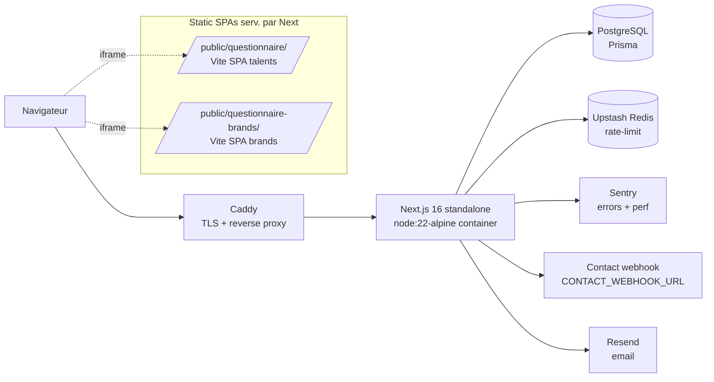
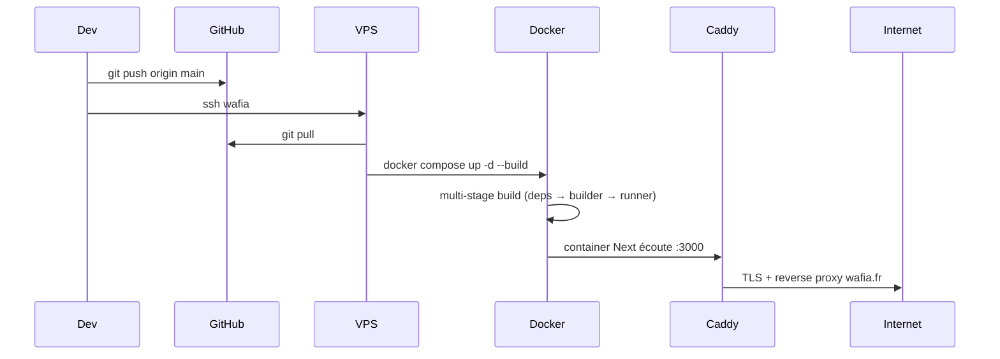

# Architecture

## Vue d'ensemble

## Pile applicative

| Couche            | Tech                                                                    |
| ----------------- | ----------------------------------------------------------------------- |
| Edge / middleware | `src/proxy.ts` — CSP nonce, HSTS, X-Frame, RBAC gate                    |
| App router        | `src/app/**` (RSC + route handlers)                                     |
| Auth              | NextAuth credentials → `src/lib/authOptions.ts`, RBAC `src/lib/rbac.ts` |
| Data              | Prisma 6 + Postgres (`prisma/schema.prisma`, multi-tenant slug)         |
| Rate limit        | Upstash Redis (`src/lib/rate-limit*.ts`)                                |
| Observabilité     | Sentry (`@sentry/nextjs`), OTLP optionnel                               |
| UI                | React 19 + Tailwind 4 + Framer Motion + tsparticles                     |

## Flux requête typique

1. Navigateur → Caddy (TLS) → container Next.
2. `src/proxy.ts` injecte un nonce, applique la CSP, vérifie le rôle pour
   `/admin/*` et `/api/v1/admin|dashboard|questionnaires/*`.
3. Le route handler valide via `enforceSameOrigin` (POST publics) puis
   `enforceRateLimitWithUpstash`, parse le body avec Zod, exécute, et renvoie
   via `apiSuccess` / `apiError`.
4. Les SPAs Vite (`/questionnaire/*`, `/questionnaire-brands/*`) reçoivent une
   CSP statique séparée (cf. `buildQuestionnaireStaticCspHeader`) et `X-Frame-Options:
SAMEORIGIN` pour pouvoir être iframées par les pages Next correspondantes.

## Déploiement

Le container final est minimal : `node server.js` (Next standalone) sous user `nextjs`.

## Décisions notables

- `npm install` (pas `npm ci`) dans le Dockerfile — drift lockfile npm Mac vs Alpine.
- Overrides npm sur `postcss`, `minimatch`, `uuid` pour patcher les CVE transitives sans
  forcer un downgrade des deps top-level (`next`, `next-auth`).
- `style-src 'unsafe-inline'` reste comme fallback derrière le nonce (Tailwind 4 + Next
  émettent encore des `<style>` non taggés).
- L'authentification admin utilise pour l'instant des credentials statiques en env
  (`ADMIN_USERNAME`/`ADMIN_PASSWORD` …). Migration prévue vers utilisateurs en DB +
  bcrypt — voir TODO dans `.env.example`.
